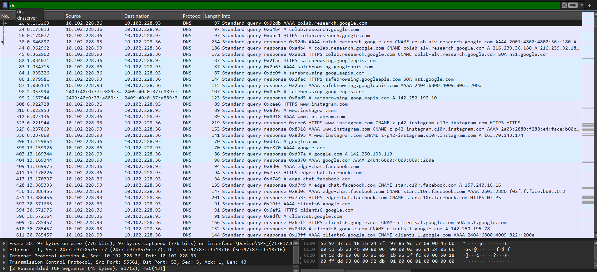
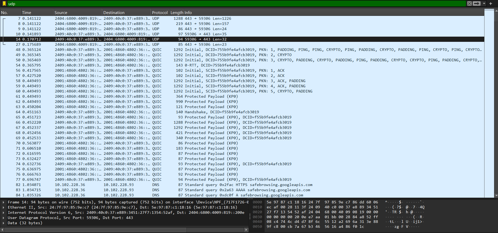
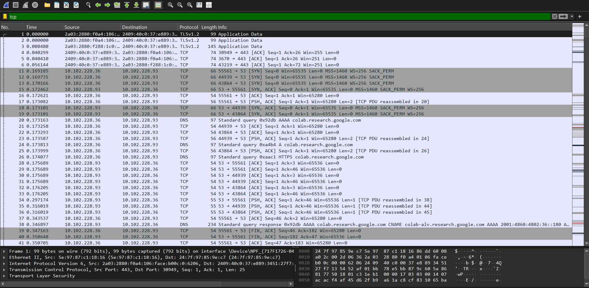
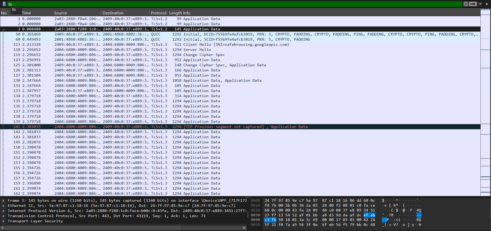

# Yash-Walhekar-Cyber-Task-5

## Wireshark Packet Analysis

### Objective
To capture live network packets using Wireshark and identify basic protocols. 

### Process
1.  Started a Wireshark capture on the active network interface. 
2. Traffic generated on the network by visiting websites and running a `ping` command. 
3.  Stopped the capture and used display filters to isolate specific protocols. 

### Protocols Identified

At least three protocols were successfully identified: 
**1. DNS (Domain Name System)**
* **What is DNS?**
* You can consider DNS to be the “phone book” of the internet. Its primary function is to turn human-readable domain names (such as `google.com`) to machine-readable Internet Protocol addresses (such as `172.217.14.228`).
* **Finding:** Filtered for `dns` to observe queries from my PC requesting the IP address for a domain name.
* **Screenshot:**
    

**2. UDP (User Datagram Protocol)**
* **What is UDP?**
* UDP is a speedy and lightweight "connectionless" protocol. It sends units of data (datagrams) without resending dropped packets tha are out-of-order, and without providing guarantees on whether the packets will arrive intact or in order. It values speed over absolute reliability.
* **Finding:** Filtered for `udp`. The DNS queries were transported using UDP, as seen in the packet details.
* **Screenshot:**
    

**3. TCP (Transmission Control Protocol)**
* **What is TCP?**
* TCP is the opposite of UDP. An excellent "connection-oriented" protocol. It guarantees the in-order, error-free delivery of all packets.
* **Finding:** Filtered for `tcp`, revealing the three-way handshake (SYN, SYN-ACK, ACK) used to establish a reliable connection for web browsing.
* **Screenshot:**
    

**4. TLS (Transport Layer Security)**
* **What is TLS?**
* TLS is the modern security protocol that provides privacy and data security for communications over the internet. It is the "S" in `https` (Hypertext Transfer Protocol Secure).
* **Finding:** Filtered for `tls`. This protocol encrypted my web browser traffic (`https`), which is why `http` packets were not visible.
* **Screenshot:**
    

### Deliverables
This repository contains:
* `Cyber Internship Task 5.pcap`: The raw packet capture file.
   
* `README.md`: This summary report.
* Screenshots of the filtered protocols. 
